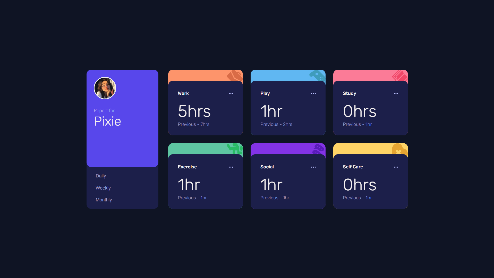
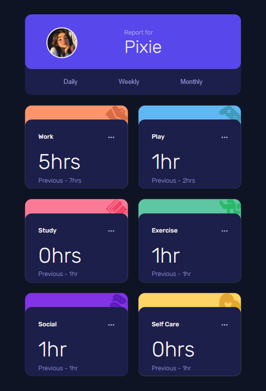
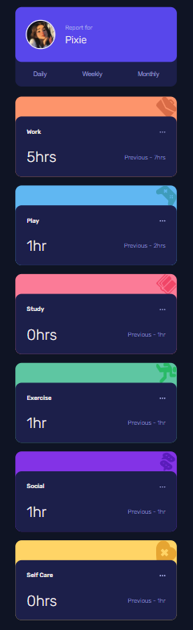

# Time Tracking Dashboard

A responsive time tracking dashboard built with HTML and CSS. The project showcases responsive layouts, CSS Grid, Flexbox, and modern UI design principles across multiple screen sizes.

## Preview

### Desktop View

### Tablet View

### Mobile View

## Features

* Responsive design for desktop, tablet, and mobile devices
* CSS Grid and Flexbox layouts
* Interactive hover states
* Modern dashboard interface
* Activity tracking cards for different categories
* Optimized layouts for multiple screen sizes

## Built With

* HTML5
* CSS3
* Flexbox
* CSS Grid
* Media Queries

## What I Learned

While building this project, I practiced:

* Creating responsive layouts for desktop, tablet, and mobile screens
* Using Flexbox for alignment and positioning
* Using CSS Grid for dashboard layouts
* Working with media queries and breakpoints
* Debugging layout, spacing, and overflow issues
* Recreating a design from a reference image

## Future Improvements

* Add JavaScript functionality for Daily, Weekly, and Monthly timeframes
* Load activity data from a JSON file
* Improve accessibility
* Add animations and transitions

## Live Demo

(https://time-tracking-dashboard-02.netlify.app/)

## Acknowledgements

Design challenge provided by Frontend Mentor.
